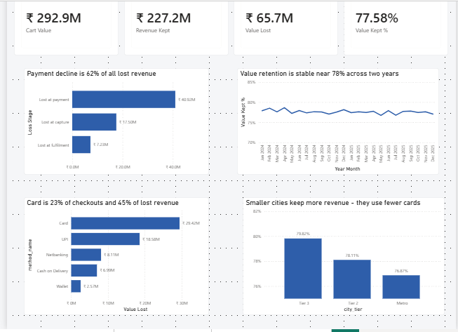
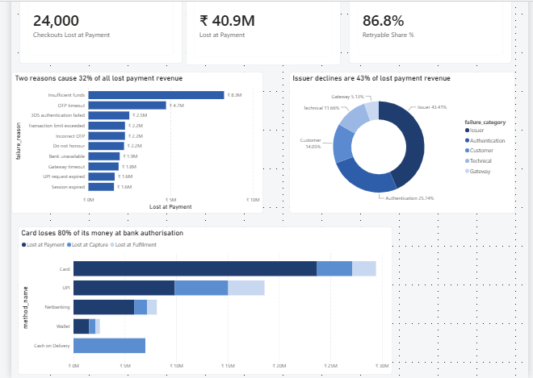
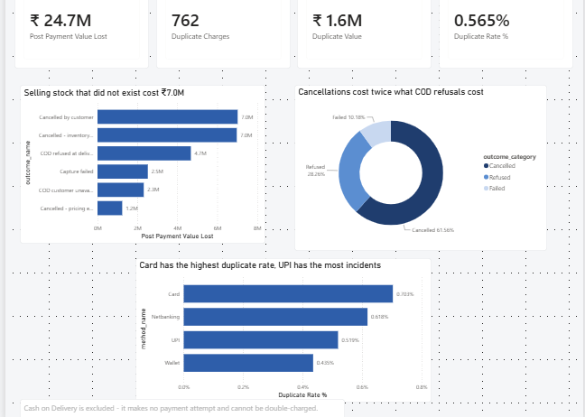

# E-commerce Payment Failure Analytics

**Where an Indian D2C brand loses revenue between checkout and cash — and which
of those losses can actually be recovered.**

SQL Server · Python · Power BI · 200,000 checkouts · 189,355 payment attempts ·
Jan 2024 – Dec 2025

---

## The business problem

When online payments fail, the usual response is to look at which error appears
most often and fix that one.

That approach has two blind spots. A common failure on cheap baskets can cost
less than a rare failure on expensive ones. And a payment that fails is not
necessarily a sale that is lost, because customers retry.

This analysis asks: **where does the money actually go, and how much of it was
ever recoverable?**

Five questions were written down, with falsifiable predictions, before any data
was generated:

1. Where does revenue leak across the checkout-to-revenue funnel?
2. Which payment failures create the greatest financial impact?
3. How much failed-payment revenue is realistically recoverable?
4. Which payment method produces the best business outcome?
5. After payment succeeds, how much revenue still fails to materialise?

---

## Executive summary

**₹227.2M of ₹292.9M in cart value becomes fulfilled revenue — 77.58%.
₹65.7M is lost.**

| Finding | Impact |
|---|---|
| **Bank authorisation** is the single largest leak | **₹40.9M — 62.3% of all lost revenue** |
| **86.8%** of that died on a failure a retry could have survived | **₹35.5M** |
| **Card** carries 22.8% of checkouts, 31.4% of value, **44.8% of losses** | **₹29.4M** |
| Retries already rescue a third of failed checkouts | **₹19.8M recovered** |
| Post-payment losses, 43.4% of them preventable | **₹24.7M, of which ₹7.0M is inventory sold but not held** |

**The practical conclusion:** the largest loss and the largest recoverable
opportunity are the same thing — card authorisation. 80.5% of everything Card
loses dies at the bank, and Card carries the biggest baskets in the business.

---

### The three dashboard pages

Each page carries one sentence. Nothing is on a page that doesn't support it.

**Page 1 — Where the money goes.** *We keep 77.6% of what customers try to spend.
The biggest single leak is bank authorisation.*



**Page 2 — Why payments fail.** *86.8% of lost payment revenue died on a failure
a retry could have survived.*



**Page 3 — After the money is taken.** *₹24.7M is lost after payment, and 43% of
it is preventable by the business.*



---

## The strongest finding, and its limits

**86.8% of revenue lost at the payment step died on a retryable failure.**

| Retryable | Checkouts lost | Value lost | Share |
|---|---|---|---|
| Yes | 20,973 | ₹35,529,607 | 86.82% |
| No | 3,027 | ₹5,394,118 | 13.18% |

Only ₹5.39M was structurally unrecoverable — expired and blocked cards, closed
accounts, fraud declines, KYC restrictions. Everything else could, in principle,
have succeeded on another attempt.

Retries already recover ₹19.79M without any intervention. **83% of that lands on
the second attempt**; the fourth attempt returned ₹313,057 across two years and
is not worth engineering.

**What this does not establish.** Whether a better retry path would capture more
of the remaining ₹35.5M cannot be answered from this dataset, because the
benefit of switching payment method was set by hand rather than measured. See
[Limitations](docs/findings.md).

---

## Answers to all five questions

| # | Question | Answer |
|---|---|---|
| 1 | Where does revenue leak? | **77.58% of cart value retained.** Largest leak is payment decline: ₹40.9M, **62.3%** of all losses, on baskets 16% larger than average |
| 2 | Which failures cost most? | **Insufficient funds** ₹8.25M (20.2%) individually; **issuer declines** ₹17.8M (43.4%) by category. Ranking by count and by money gives nearly the same order |
| 3 | How much is recoverable? | **32.71%** of failed checkouts already recover, worth **₹19.79M**. 83% of that on the second attempt |
| 4 | Which method performs best? | **UPI** — highest success rate (87.19%), highest volume, and **57% more revenue than Card**. Card is worst on every outcome measure |
| 5 | What is lost after payment? | **₹24.7M.** Cancellations ₹15.2M (61.6%) — more than double COD refusals. **₹7.0M** was inventory sold but not held |

Full analysis with every table, prediction verdict and limitation:
**[docs/findings.md](docs/findings.md)**

---

## Three things this analysis deliberately does not claim

**Two headline results are inputs, not discoveries.** Cards were configured to
carry larger baskets and to fail most often. So "expensive orders land on the
least reliable method" follows arithmetically from two values chosen in the
generator. What is genuinely measured is the *size* of that interaction and how
it ranks against the other leaks.

**Switching payment method is not proven to help.** The data shows switching
recovers 75.14% against 45.93% for staying — a ratio of **1.636**. The generator
sets `SWITCH_METHOD_PENALTY = 0.90` and `SAME_METHOD_RETRY_PENALTY = 0.55`, which
divide to **1.636**. The query returned the assumption it was given. What *is*
worth acting on is that only **46.2%** of retrying customers ever try a second
method.

**Three of five predictions were wrong, and one analysis returned nothing.**
Q1 predicted the biggest loss would come before payment was attempted — it came
after. Q2 predicted count and money rankings would diverge — they barely moved.
Q5 predicted COD refusal would be the largest post-payment leak — cancellations
cost more than double. Separately, testing whether retrying raises duplicate-charge
risk produced a null result, and is reported as one.

---

## A data contradiction found during the build

Building the dashboard surfaced **45 rows where `is_duplicate_charge = 1` but
`captured_datetime` is NULL** — a customer recorded as charged twice on an order
that was never charged once.

The schema has CHECK constraints that make many invalid states impossible,
including "no capture means no revenue", which held correctly. But no constraint
covered duplicate charges, so the database accepted the contradiction.

It was only caught because every Power BI measure is reconciled against its SQL
equivalent before it goes on a page. All duplicate-charge figures are therefore
scoped to captured checkouts. A `ck_duplicate_requires_capture` constraint would
have blocked these rows at load time.

---

## A note on the data

**This dataset is synthetic**, generated by the scripts in [`src/`](src/). No real
customer, merchant or payment data was used.

Every behavioural assumption — success rate by method, retry willingness, decline
reason mix, fulfilment failure rates, festival seasonality, the Indian payday
effect — is an explicit, editable value in a configuration block at the top of a
generator script. The analysis quantifies the consequences of those assumptions.
It cannot validate the assumptions themselves.

Random seeds are fixed, so anyone running these scripts gets **exactly the
numbers shown here**.

Full limitations, including two designed-but-never-generated failure reasons and
the absence of pre-payment abandonment, are listed in
[docs/findings.md](docs/findings.md).

---

## What was built

### SQL Server

- **Schema defined explicitly** — ten tables with types chosen per column,
  primary keys, foreign keys, and CHECK constraints that make invalid states
  impossible to insert (a successful attempt cannot carry a failure reason; a
  checkout with no capture cannot carry revenue)
- A reporting view (`vw_checkout_enriched`) that flattens attempt-level facts
  onto the checkout row, resolving ambiguous relationship paths before they
  reach the BI layer
- Analysis using CTEs, window functions (`ROW_NUMBER`, `RANK`, `SUM OVER`),
  conditional aggregation, and `INFORMATION_SCHEMA`
- A repeatable data quality report, and reconciliation of every question's
  totals back to the funnel figures established in Q1

### Python

- Four seeded generators producing eight dimension tables and two fact tables
- Lognormal cart values, because basket sizes have a long right tail
- Modelled Indian payment behaviour: UPI dominance, tier-dependent method mix,
  Cash on Delivery rising from 10% in metros to 36% in Tier 3, festival
  seasonality, and a month-end payday effect on insufficient-funds declines
- Loading via SQLAlchemy in dependency order with `fast_executemany`

### Power BI

- Single-fact star schema built on the database view
- Marked date table with explicit sort-by columns
- DAX using `CALCULATE`, `DIVIDE`, `SWITCH`, and window-function equivalents
- Three pages, each carrying one sentence; every measure reconciled against SQL
- A saved theme file so styling is a system rather than per-visual decoration

### Git

Feature branches and pull requests, with conventional commit messages.

---

## Reproducing this

Requires SQL Server (Express is fine), Python 3.11+, and Power BI Desktop.

```bash
git clone git@github.com:govardhani-data/ecommerce-payment-failure-analytics.git
cd ecommerce-payment-failure-analytics

python -m venv .venv
.\.venv\Scripts\Activate.ps1
pip install -r requirements.txt
```

Then:

1. In SSMS: `CREATE DATABASE VanyaPaymentsDB;`
2. Run `sql/01_schema/01_create_tables.sql`
3. `python src/generate_dimensions.py`
4. `python src/generate_checkouts.py`
5. `python src/generate_attempts.py`
6. `python src/generate_fulfilment.py`
7. `python src/load_to_sql.py`
8. Run `sql/01_schema/02_create_views.sql`
9. Run `sql/02_analysis/01_data_quality_checks.sql` — every check should pass
10. Run `sql/02_analysis/02_q1_funnel.sql` through `06_q5_post_payment_loss.sql`
11. Open `powerbi/support-payment-dashboard.pbix`

**Prerequisite:** SQL Server needs TCP/IP enabled and the SQL Browser service
running, or Power BI cannot connect to `(local)\SQLEXPRESS`.

---

## Repository structure

```
ecommerce-payment-failure-analytics/
│
├── src/
│   ├── generate_dimensions.py      eight lookup tables, seeded
│   ├── generate_checkouts.py       200,000 checkouts
│   ├──
